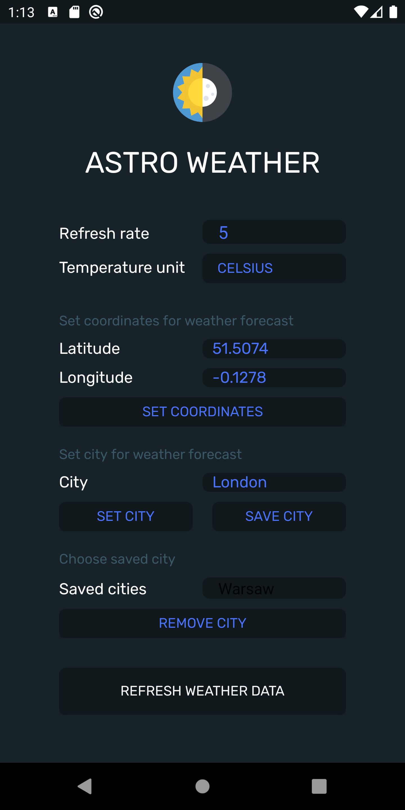
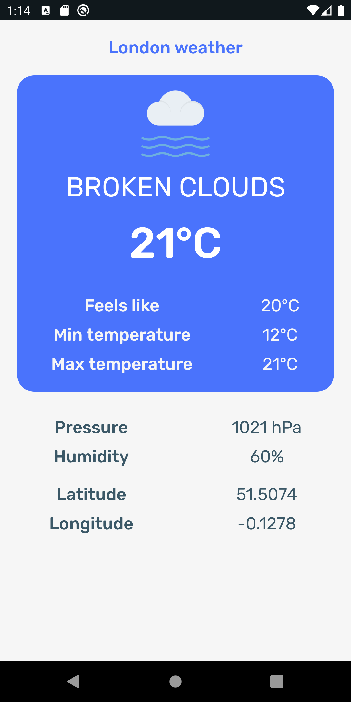
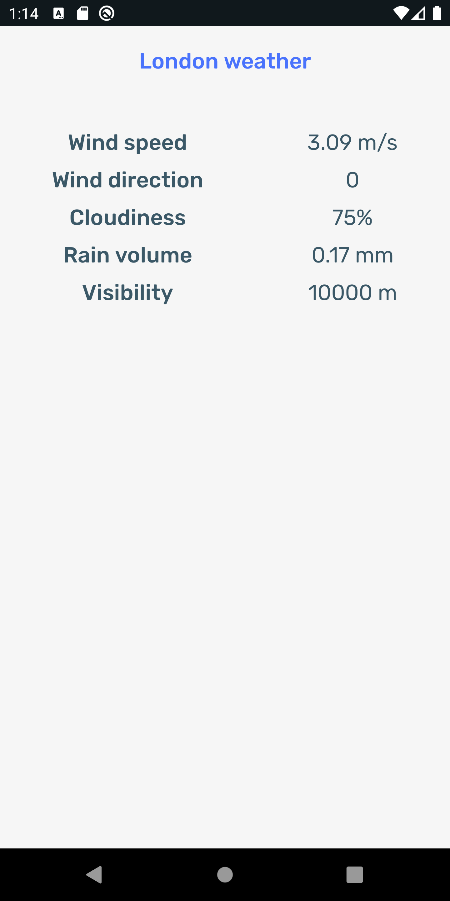
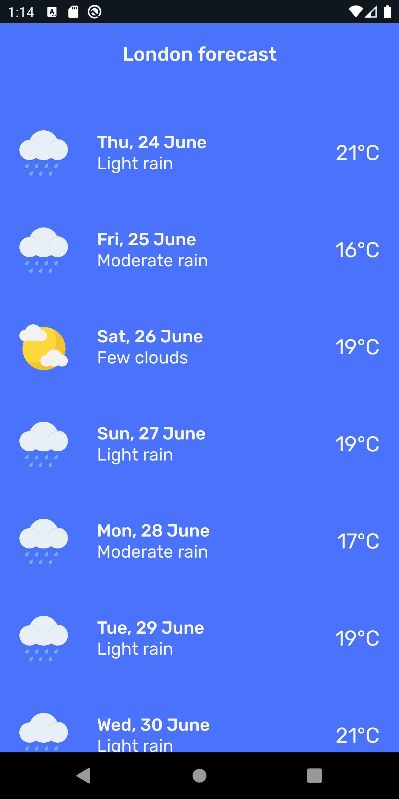
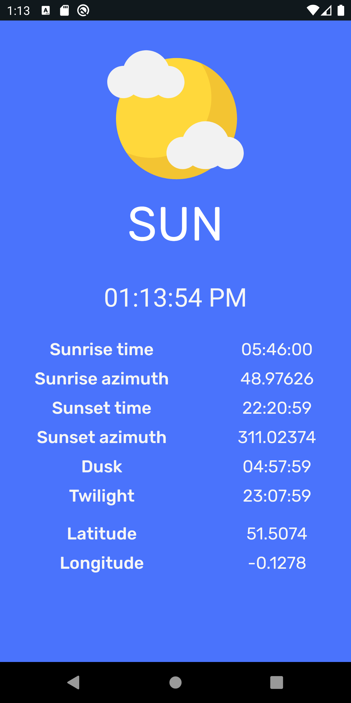
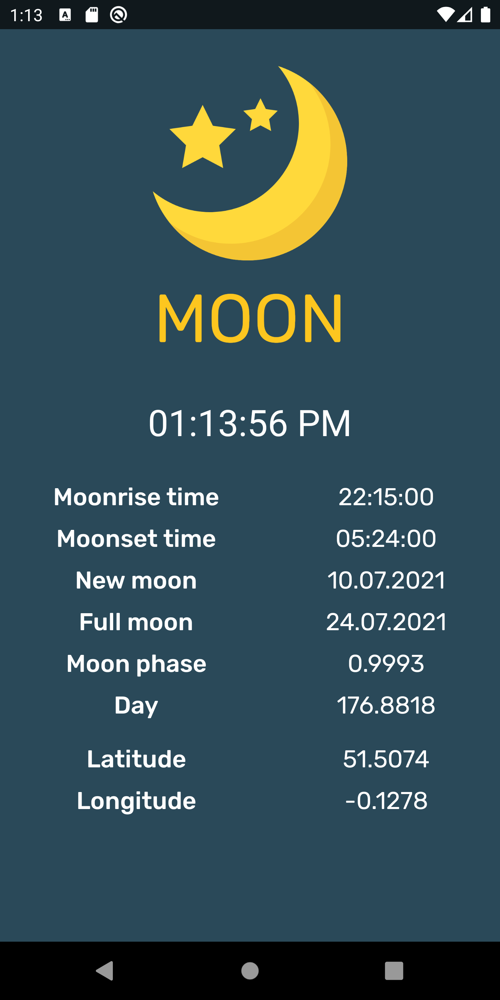

# astro-weather-android

## About
Weather app made for a University Project

## Features
- Current weather
- 7 days forecast
- Sun and moon info
- Location found with name or latitude and longitude
- Save favorite places
- Automatic data refresh

## Screenshots

  
  
  

  
  
  

